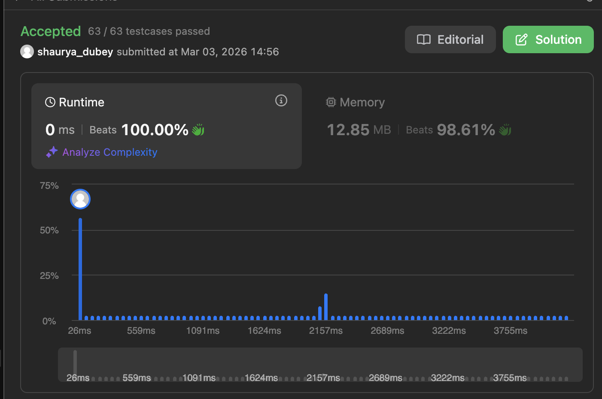
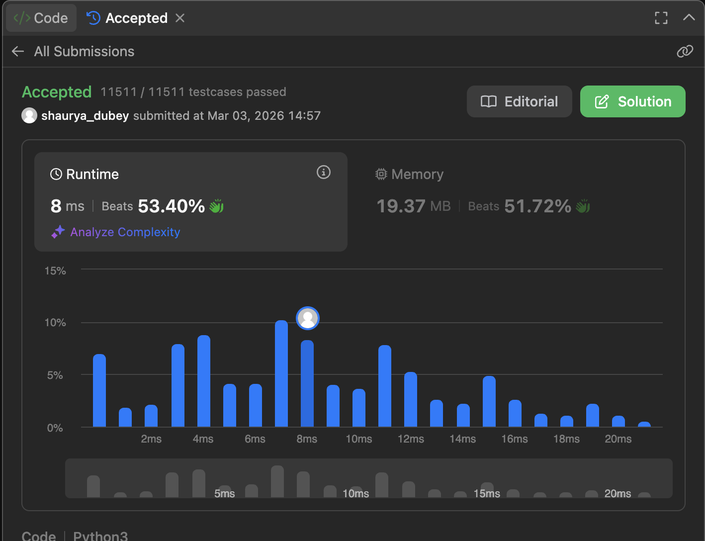

After practicing my behavioral interview skills with Rio, I learned alot about the STAR method and my strengths and weaknesses. One thing I learned is to take time to plan your entire response before starting to speak in order to limit yourself from stuttering or losing your train of thought. I also learned that being able to map these stories out before hand help when it comes to delivering them confidently. I think with more practice of using the STAR method I can quickly improve my behavior interview skills.

